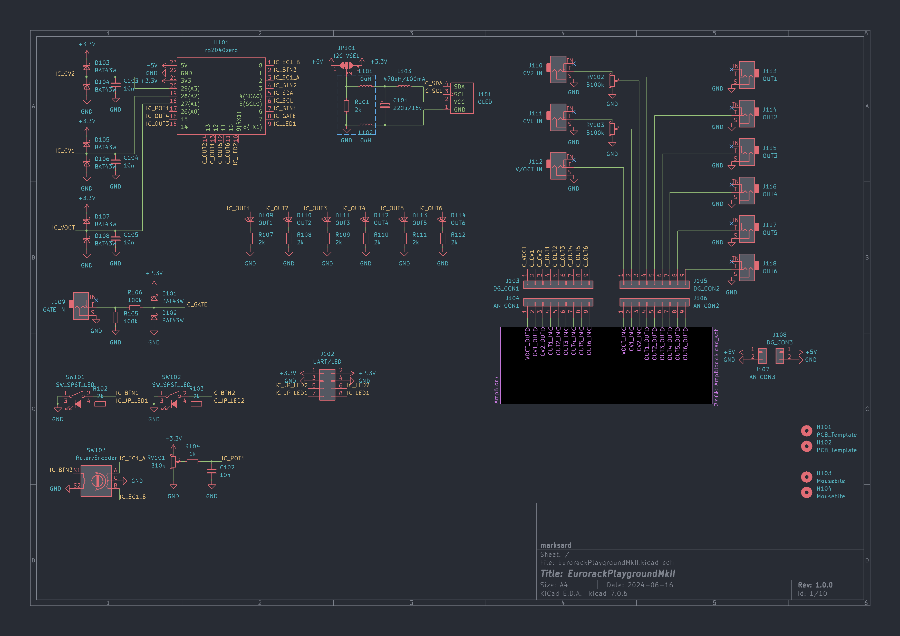
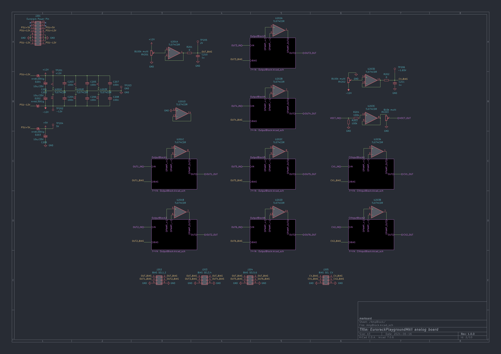
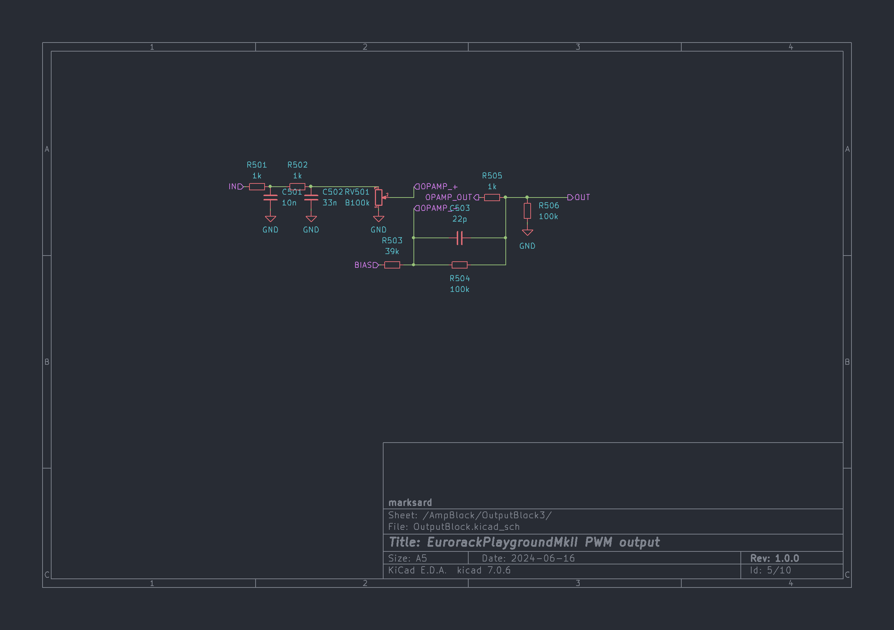
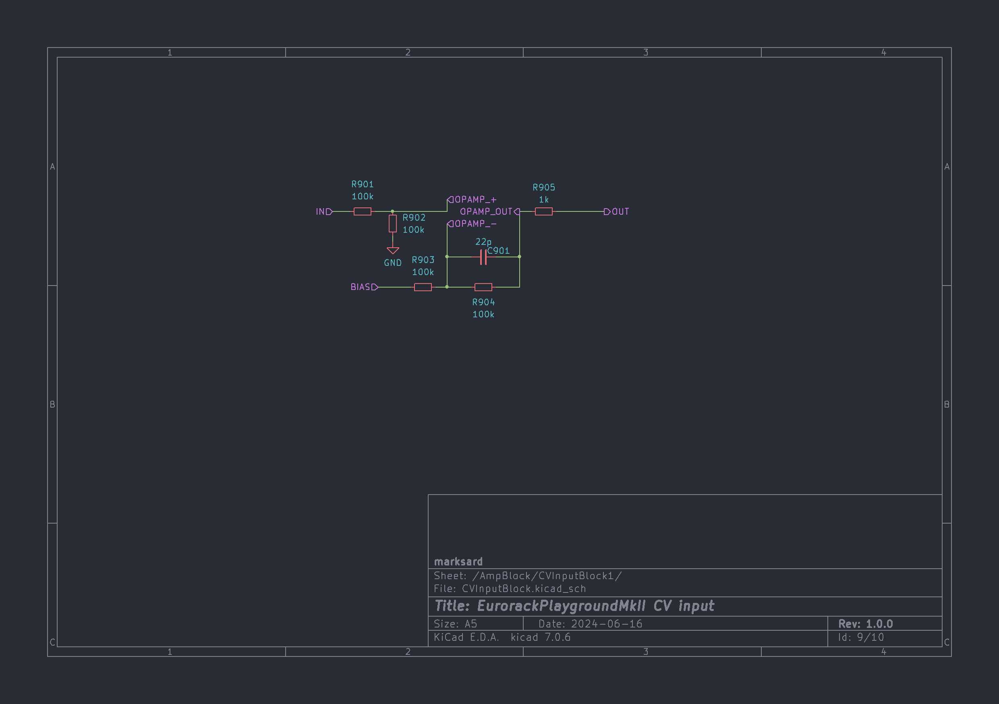

# Eurorack Playground MkII
10HP Eurorack modular compatible application playground

## Specification

### Input

|Name|Description|
|:--|:--|
|V/OCT|ADC in|
|GATE|Digital in|
|CV1|ADC in with pot With bipolar and unipolar switching function|
|CV2|ADC in with pot With bipolar and unipolar switching function|

### Output

|Name|Description|
|:--|:--|
|OUT 1~6|PWM out|

With PWM output confirmation LED.  
2nd order CR lowpass filter cutoff frequency: 8.7kHz  
Opamp buffered out with bipolar and unipolar switching function.  

### Controller

For application control

|Name|Description|
|:--|:--|
|Pot||
|Encoder||
|Button A||
|Button B||
|Encoder Button(Button C)||
|Buttion A LED||
|Buttion B LED||

## Image

## Schematic

  
  
  
  

### Note
The common bias circuitry affects channel separation. I knew this and made it common, but if you are going to copy the circuit, it is better to modify it.  

## Demonstration
  

  
